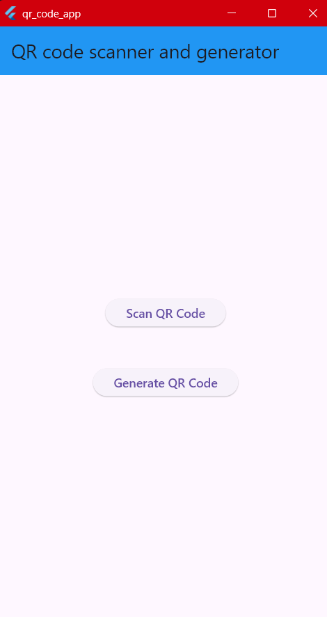
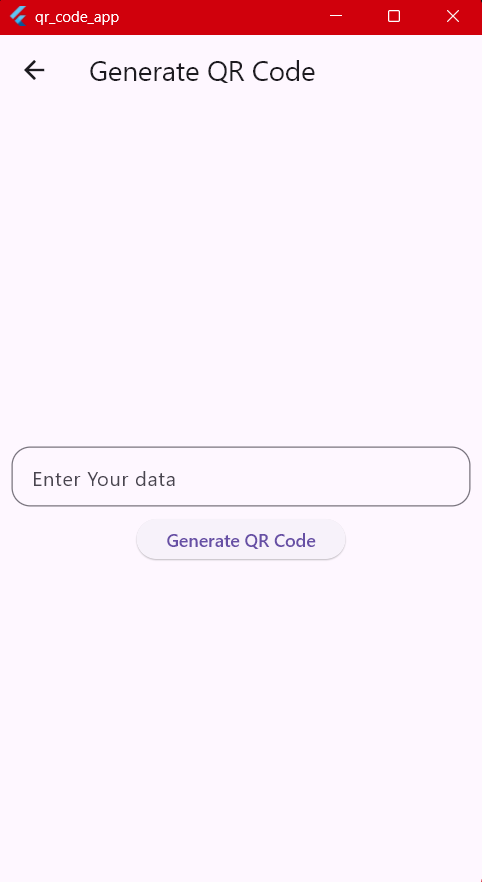
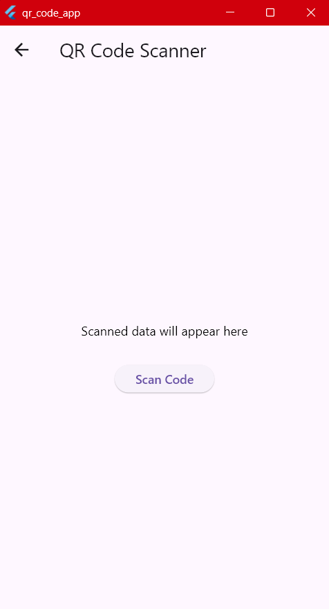

# 📱 QR Code Scanner & Generator

A modern Flutter application that enables users to **generate QR codes** from text or URLs and **scan QR codes** instantly using the device camera. Built with Flutter to provide a fast, responsive, and user-friendly experience.

---

## ✨ Features

- 🔳 Generate QR codes from any text or URL
- 📷 Scan QR codes using the device camera
- ⚡ Fast and accurate QR detection
- 🎨 Clean and intuitive Material Design UI
- 📱 Cross-platform support (Android & iOS)
- 🚀 Lightweight and easy to use

---

## 📸 Screenshots

| Home | Generate QR | Scan QR |
|------|-------------|----------|
|  |  |  |

---

## 🛠️ Tech Stack

| Technology | Description |
|------------|-------------|
| Flutter | Cross-platform UI toolkit |
| Dart | Programming language |
| qr_flutter | QR code generation |
| flutter_barcode_scanner | QR code scanning |

---

## 📂 Project Structure

```text
lib/
│
├── main.dart
├── generate_qr_code.dart
└── scan_qr_code.dart
```

---

## 🚀 Getting Started

### 1️⃣ Clone the Repository

```bash
git clone https://github.com/Mayurs26/qr_code_app.git
```

### 2️⃣ Navigate to the Project

```bash
cd qr_code_app
```

### 3️⃣ Install Dependencies

```bash
flutter pub get
```

### 4️⃣ Run the Application

```bash
flutter run
```

---

## 📦 Dependencies

```yaml
dependencies:
  flutter:
    sdk: flutter

  qr_flutter: ^4.1.0
  flutter_barcode_scanner: ^2.0.0
```

---

## 🎯 Future Improvements

- 🌐 Scan QR codes directly from images
- 📚 QR scan history
- ❤️ Favorite QR codes
- 📤 Share generated QR codes
- 💾 Save QR codes to the gallery
- 🌙 Dark Mode support
- 🎨 Customize QR colors and styles

---

## 🤝 Contributing

Contributions, suggestions, and improvements are always welcome.

1. Fork the repository.
2. Create a new feature branch.
3. Commit your changes.
4. Open a Pull Request.

---

## 👨‍💻 Author

**Mayur Sonawane**

- GitHub: https://github.com/Mayurs26

---

## ⭐ Support

If you found this project helpful, consider giving it a ⭐ on GitHub. It helps others discover the project and supports future development.